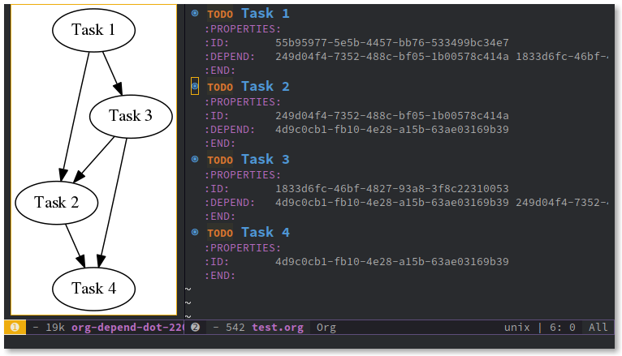

# Readme of org-dpnds.el

`org-dpnds` is an extension to `org-mode` providing the possibility to model dependencies between headlines. On top of this, it provides functionality to visualize these dependencies. Four commands (as in user facing functionality) have been implemented at this point:

- `org-dpnds-add-dependency`
  Add any headline as a dependency to the headline at point. With a prefix arg, the user is offered the choice of which headline to add the dependency to.
- `org-dpnds-capture-dependency`
  Call `org-capture` to create a new headline and then adds the new headline as a dependency to the headline at point.
- `org-dpnds-agenda-dependencies`
  Display the direct dependencies of the headline at point as an agenda view. With a prefix arg, also include all transitive dependencies. 
- `org-dpnds-show-dependency-graph`
  Generate and display a dependency graph of the current file. This is done with graphviz.
  
